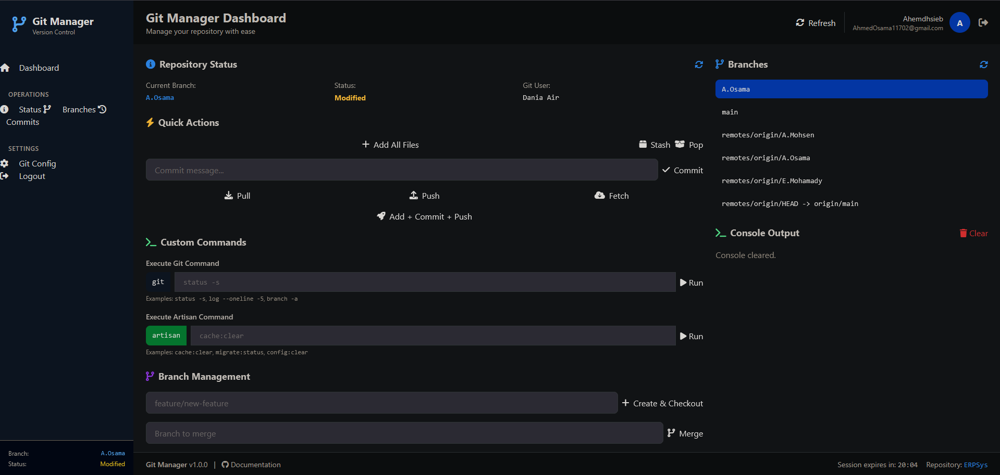

# Laravel Git Manager

[](https://packagist.org/packages/ahmedhsieb/laravel-git-manager)
[](https://packagist.org/packages/ahmedhsieb/laravel-git-manager)
[](https://packagist.org/packages/ahmedhsieb/laravel-git-manager)

A complete, production-ready Git management interface for Laravel applications. Manage your repository through a beautiful web interface without ever touching the terminal.



## ✨ Features

### 🎯 Core Git Operations
- **Add, Commit, Push, Pull, Fetch** - All basic Git operations
- **Branch Management** - Create, switch, merge, and delete branches
- **Stash Operations** - Stash and apply changes
- **Reset & Revert** - Undo changes safely
- **Status Monitoring** - Real-time repository status

### 🚀 Advanced Features
- **Custom Git Commands** - Execute any git command
- **Custom Artisan Commands** - Run Laravel commands
- **Real-time Output Console** - See command results instantly
- **Branch Switcher** - Quick branch navigation
- **Commit History** - View recent commits
- **File Diff Viewer** - Check file differences

### 🔐 Security Features
- **Password Protection** - Secure access with bcrypt hashed passwords
- **Session Management** - Configurable session timeout
- **Dangerous Command Blocking** - Prevents destructive commands
- **CSRF Protection** - All requests protected
- **IP Whitelisting** - Optional IP restrictions

### 🎨 User Experience
- **Beautiful UI** - Modern, responsive design with Tailwind CSS
- **Standalone Layout** - No dependencies on your app's layout
- **Real-time Updates** - Live status and branch information
- **Keyboard Shortcuts** - Ctrl+Enter to commit quickly
- **Dark Console** - Terminal-style output display

## 📋 Requirements

- PHP 7.4 or higher
- Laravel 8.x, 9.x, 10.x, or 11.x
- Git installed on server
- Composer

## 🚀 Installation

### Step 1: Install Package

```bash
composer require ahmedhsieb/laravel-git-manager
```

The package will be automatically discovered by Laravel.

### Step 2: Run Setup Wizard

```bash
php artisan git-manager:setup
```

The interactive setup wizard will ask you for:

1. **Git Username** - Your GitHub/GitLab/Bitbucket username
2. **Personal Access Token** - Your Git provider token
3. **User Name** - Name that appears in commits
4. **User Email** - Email that appears in commits
5. **Access Password** - Password to protect the web interface

### Step 3: Generate Personal Access Token

#### GitHub
1. Go to https://github.com/settings/tokens
2. Click "Generate new token (classic)"
3. Give it a name: "Laravel Git Manager"
4. Select scopes: ✅ `repo` (Full control of private repositories)
5. Click "Generate token"
6. Copy the token (save it - you won't see it again!)

#### GitLab
1. Go to https://gitlab.com/-/profile/personal_access_tokens
2. Create new token
3. Select scopes: `api`, `read_repository`, `write_repository`
4. Create and copy the token

#### Bitbucket
1. Go to https://bitbucket.org/account/settings/app-passwords/
2. Create app password
3. Select permissions: Repositories (Read, Write, Admin)
4. Create and copy the password

### Step 4: Access Git Manager

Visit: `http://your-domain.com/git-manager`

Login with the password you set during setup.

## 🎯 Usage

### Web Interface

#### Basic Workflow
1. Click **"Pull"** to get latest changes
2. Make your code changes
3. Type a commit message
4. Click **"Add + Commit + Push"**

#### Branch Management
- **Create Branch**: Type branch name → Click "Create & Checkout"
- **Switch Branch**: Click any branch in the sidebar
- **Merge Branch**: Type branch name → Click "Merge"

#### Custom Commands
Execute any git command:
```
status -s
log --oneline -10
branch -a
remote -v
```

Execute any artisan command:
```
cache:clear
migrate:status
queue:work --once
```

### Command Line

#### Update Configuration
```bash
# Update any setting
php artisan git-manager:config

# Update specific setting
php artisan git-manager:config username
php artisan git-manager:config password
php artisan git-manager:config token
```

#### Check Status
```bash
php artisan route:list | grep git-manager
```

## ⚙️ Configuration

### Publishing Configuration File

```bash
php artisan vendor:publish --tag=git-manager-config
```

This creates `config/git-manager.php` where you can customize:

```php
return [
    'username' => env('GIT_MANAGER_USERNAME', ''),
    'token' => env('GIT_MANAGER_TOKEN', ''),
    'user_name' => env('GIT_MANAGER_USER_NAME', ''),
    'user_email' => env('GIT_MANAGER_USER_EMAIL', ''),
    'access_password' => env('GIT_MANAGER_PASSWORD', ''),
    'session_duration' => env('GIT_MANAGER_SESSION_DURATION', 120), // minutes
    'route_prefix' => env('GIT_MANAGER_ROUTE_PREFIX', 'git-manager'),
    'middleware' => ['web'],
    'timeout' => env('GIT_MANAGER_TIMEOUT', 300), // seconds
];
```

### Environment Variables

Add to your `.env` file:

```env
GIT_MANAGER_USERNAME=your-github-username
GIT_MANAGER_TOKEN=ghp_your_token_here
GIT_MANAGER_USER_NAME="Your Full Name"
GIT_MANAGER_USER_EMAIL=your@email.com
GIT_MANAGER_PASSWORD=your_hashed_password
GIT_MANAGER_SESSION_DURATION=120
GIT_MANAGER_ROUTE_PREFIX=git-manager
GIT_MANAGER_TIMEOUT=300
```

### Custom Route Prefix

Change the URL prefix in `.env`:

```env
GIT_MANAGER_ROUTE_PREFIX=admin/git
```

Access at: `http://your-domain.com/admin/git`

### Additional Middleware

Add authentication or other middleware:

```php
// config/git-manager.php
'middleware' => ['web', 'auth', 'admin'],
```

### Publishing Views

To customize the views:

```bash
php artisan vendor:publish --tag=git-manager-views
```

Views will be published to `resources/views/vendor/git-manager/`

## 🔒 Security

### Password Protection

The interface is protected by a password set during setup. Passwords are bcrypt hashed and never stored in plain text.

### Session Management

Sessions expire after 2 hours (configurable). Users must login again after expiration.

### IP Whitelisting

Add IP restrictions by modifying your routes:

```php
// routes/web.php
Route::prefix(config('git-manager.route_prefix'))
    ->middleware(function ($request, $next) {
        $allowedIps = ['127.0.0.1', 'your.server.ip'];
        if (!in_array($request->ip(), $allowedIps)) {
            abort(403);
        }
        return $next($request);
    })
    ->group(function () {
        // Git Manager routes
    });
```

### Dangerous Commands

Dangerous commands like `rm`, `clean -fd`, and `reset --hard HEAD~` are blocked automatically.

## 📝 API Endpoints

All endpoints require authentication via password-protected session.

### Repository Info
- `GET /git-manager/status` - Repository status
- `GET /git-manager/current-branch` - Current branch
- `GET /git-manager/branches` - List all branches
- `GET /git-manager/log?limit=10` - Commit history

### Operations
- `POST /git-manager/add` - Stage files
- `POST /git-manager/commit` - Commit changes
- `POST /git-manager/push` - Push to remote
- `POST /git-manager/pull` - Pull from remote
- `POST /git-manager/fetch` - Fetch from remote

### Branch Management
- `POST /git-manager/checkout` - Switch branch
- `POST /git-manager/branch/create` - Create branch
- `POST /git-manager/merge` - Merge branch
- `DELETE /git-manager/branch/delete` - Delete branch

### Advanced
- `POST /git-manager/custom` - Execute custom git command
- `POST /git-manager/artisan` - Execute artisan command
- `POST /git-manager/full-push` - Add + Commit + Push

## 🐛 Troubleshooting

### "Setup Required" Page Shows

Run the setup command:
```bash
php artisan git-manager:setup
```

### "Authentication Failed" on Push/Pull

1. Check token is valid: Visit GitHub → Settings → Tokens
2. Verify token has `repo` scope
3. Update token:
   ```bash
   php artisan git-manager:config token
   ```

### "Please tell me who you are" Error

Configure git user:
```bash
php artisan git-manager:config user_name
php artisan git-manager:config user_email
```

Or manually:
```bash
git config --global user.name "Your Name"
git config --global user.email "your@email.com"
```

### Permission Denied

Give web server write access:
```bash
# Linux/Unix
sudo chown -R www-data:www-data /path/to/repo
sudo chmod -R 775 /path/to/repo/.git

# Or for nginx
sudo chown -R nginx:nginx /path/to/repo
```

### Commands Timeout

Increase timeout in `.env`:
```env
GIT_MANAGER_TIMEOUT=600
```

### Views Not Loading

Clear cache:
```bash
php artisan view:clear
php artisan cache:clear
php artisan config:clear
```

### Routes Not Working

Clear route cache:
```bash
php artisan route:clear
composer dump-autoload
```

## 💡 Tips & Best Practices

### Commit Messages

Use clear, descriptive commit messages:
```
feat: Add user authentication
fix: Resolve login issue
docs: Update README
style: Format code
refactor: Simplify validation logic
```

### Branch Naming

Follow a consistent naming convention:
```
feature/new-feature
bugfix/issue-123
hotfix/critical-fix
release/v1.0.0
```

### Workflow

1. Always **pull** before starting work
2. Create a **feature branch** for new work
3. **Commit** frequently with clear messages
4. **Push** regularly to backup your work
5. **Merge** when feature is complete

### Safety

- Always **pull** before pushing
- Review changes before committing
- Use **stash** when switching branches with uncommitted changes
- Be careful with **reset --hard**

## 🤝 Contributing

Contributions are welcome! Please feel free to submit a Pull Request.

1. Fork the repository
2. Create your feature branch (`git checkout -b feature/AmazingFeature`)
3. Commit your changes (`git commit -m 'Add some AmazingFeature'`)
4. Push to the branch (`git push origin feature/AmazingFeature`)
5. Open a Pull Request

## 📄 License

This package is open-sourced software licensed under the [MIT license](LICENSE).

## 👨‍💻 Author

**Ahmed Osama**
- Email: AhmedOsama11702@gmail.com
- GitHub: [@ahmedhsieb](https://github.com/ahmedhsieb)

## 🙏 Acknowledgments

- Built with [Laravel](https://laravel.com)
- UI powered by [Tailwind CSS](https://tailwindcss.com)
- Icons by [Font Awesome](https://fontawesome.com)

## 📊 Stats


## 🔗 Links

- [GitHub Repository](https://github.com/ahmedhsieb/laravel-git-manager)
- [Packagist](https://packagist.org/packages/ahmedhsieb/laravel-git-manager)
- [Issue Tracker](https://github.com/ahmedhsieb/laravel-git-manager/issues)
- [Changelog](CHANGELOG.md)

## 💬 Feedback

If you have any feedback, please reach out to me at AhmedOsama11702@gmail.com
---

**If you find this package helpful, please consider giving it a ⭐ on GitHub!**